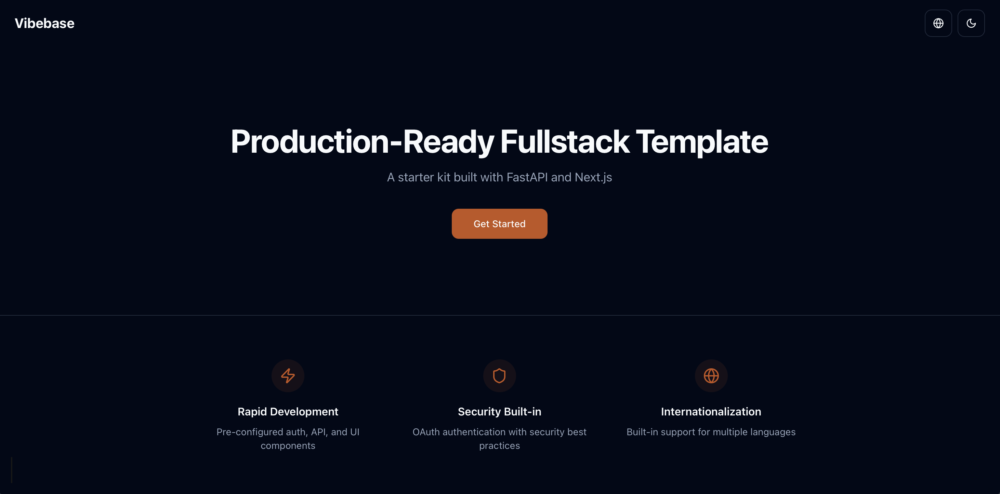

# Vibebase

A base repository for quickly bootstrapping any service.

Here is a preview image of the Vibebase project.



## Quick Start

### Backend

```bash
cd core
uv sync --frozen
uv run uvicorn api.main:app --reload
```

### Frontend

```bash
cd frontend
pnpm install
pnpm dev
```

### Docker

```bash
docker-compose up
```
